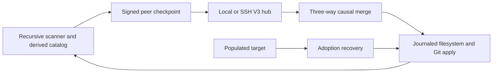

# CodeFolderSync documentation

This repository owns the CodeFolderSync V3 product, operational contract, and engineering documentation.

V3 is an incompatible replacement for V2. The active CLI imports `codefoldersync/src/v3/`; `src/v2/` is retained only as archived implementation and shared installation code while historical harnesses are retired.

## System shape

The synchronized unit is one recursive included namespace. Git repositories are automatically discovered semantic boundaries, not membership records. One authority signs configuration and the one-way adoption barrier. During adoption only the authority can publish. In normal mode every enrolled peer can publish a signed causally based checkpoint.

## Non-negotiable invariants

1. The authority tree is never mutated by target adoption.
2. A target path is moved to out-of-root recovery before adoption replaces or removes it.
3. A stable normal-mode byte sequence that loses a causal race remains a visible conflict or retained recovery object.
4. Immutable objects are SHA-256 addressed and verified on read.
5. Objects reach durable storage before a signed checkpoint can reference them.
6. The durable outbox retries the exact event after an unknown response.
7. The hub rejects a reused event ID with a changed payload.
8. Target apply force-revalidates the local namespace before mutation.
9. Symlinks are scanned with `lstat` and never followed.
10. `.git` metadata applies as a complete staged and verified boundary.
11. Reserved paths, traversal, aliases, mounts, external Git dirs, unsupported objects, corruption, and ambiguous state fail closed.
12. Automatic object and recovery deletion remains disabled.

## Documentation map

| Area                                  | Document                                              |
| ------------------------------------- | ----------------------------------------------------- |
| Components and ownership              | [Architecture](architecture.md)                       |
| Types, manifests, SQLite, identity    | [Data model](data-model.md)                           |
| Scan, merge, adoption, apply          | [Sync engine](sync-engine.md)                         |
| Local and SSH framed RPC              | [Protocol](protocol.md)                               |
| Outbox, journals, recovery, retention | [Durability and recovery](durability-and-recovery.md) |
| Filesystem and trust policy           | [Safety model](safety-model.md)                       |
| Visible and retained conflicts        | [Conflicts](conflicts.md)                             |
| Setup, enrollment, services           | [Installation](installation.md)                       |
| Operator workflow                     | [Operations](operations.md)                           |
| Executable acceptance                 | [Acceptance scenarios](acceptance-scenarios.md)       |
| Maintainer workflow                   | [Development](development.md)                         |

## Source ownership

| Source                             | Responsibility                                                     |
| ---------------------------------- | ------------------------------------------------------------------ |
| `src/product-cli.ts`               | Active V3 CLI, daemon, lifecycle and service gates                 |
| `src/v3/types.ts`                  | Schema/protocol 3 contracts                                        |
| `src/v3/config.ts`                 | Authority and peer keys, signed revisions, projections             |
| `src/v3/ignore.ts`                 | Root ignore compiler and hard exclusions                           |
| `src/v3/catalog.ts`                | Recursive discovery, stable nodes, Git boundaries, semantic digest |
| `src/v3/objects.ts`                | Immutable chunks/manifests and materialization                     |
| `src/v3/state.ts`                  | Derived catalog, durable outbox, journals, conflicts               |
| `src/v3/hub.ts`                    | CAS checkpoints, config authority, barrier and history             |
| `src/v3/transport.ts`              | Local adapter and bounded framed SSH process                       |
| `src/v3/engine.ts`                 | Seal, adoption, merge, apply, verify and recovery                  |
| `src/v3/setup.ts`                  | Authority setup and target-local enrollment                        |
| `test/product.integration.test.ts` | Focused V3 end-to-end proof                                        |

## Vocabulary

- **Authority**: the only peer allowed to sign configuration, enrollment, ignore, and cutover revisions.
- **Peer**: one enrolled machine identity with a target-local private key.
- **Folder**: one recursive synchronization namespace with one folder ID.
- **Catalog**: rebuildable local observation state; never operator-managed membership.
- **Snapshot**: one immutable namespace manifest plus discovered Git boundaries.
- **Sequence**: the hub-assigned causal order.
- **Adoption recovery**: target-originated evidence displaced before source materialization.
- **Apply recovery**: the prior live value moved aside by a normal transaction.

## Current proof boundary

Repository tests prove local process-isolated V3 behavior in fresh roots. The repository implementation does not claim that the plan's Google Drive backup, immutable real-snapshot fixtures, or real three-machine daily-driver adoption gates have run. Those remain external acceptance gates and may not be inferred from `pnpm check`.
